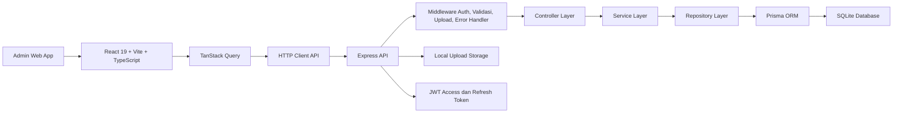
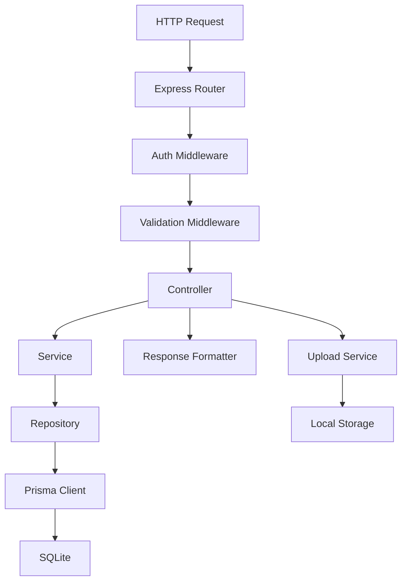
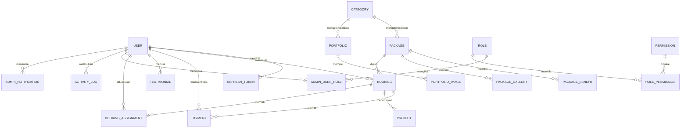

## 1. Desain Arsitektur



* Frontend admin berjalan pada aplikasi React terpisah di `apps/client` dan mengakses API Express di `apps/server`.

* Kondisi repo saat ini sudah memiliki route, controller, Prisma schema, serta halaman admin dasar. Implementasi lanjutan diarahkan untuk merapikan struktur ke pola `Controller -> Service -> Repository` tanpa memutus kompatibilitas fitur yang sudah ada.

* Seluruh modul admin menggunakan kontrak API yang konsisten, proteksi JWT untuk route privat, serta state server berbasis TanStack Query agar cepat dan mudah dikembangkan.

## 2. Deskripsi Teknologi

* Frontend: React 19 + TypeScript + Vite 6

* Styling: TailwindCSS 4 + komponen UI berbasis Radix/shadcn-style + `lucide-react`

* State Server: TanStack Query 5

* Form dan Validasi: React Hook Form 7 + Zod 3

* Motion: Framer Motion 12

* Router: React Router DOM 7

* Backend: Express 4 + TypeScript

* ORM dan Database: Prisma 6 + SQLite

* Autentikasi: JWT access token + refresh token

* Upload Media: Multer + Sharp + local file storage

* Monorepo: npm workspaces dengan root package untuk menjalankan client dan server bersamaan

## 3. Definisi Route

| Route                     | Tujuan                                                                                        |
| ------------------------- | --------------------------------------------------------------------------------------------- |
| `/admin`                  | Entry route admin, redirect ke dashboard bila sesi valid atau ke login bila belum autentikasi |
| `/admin/login`            | Halaman login administrator                                                                   |
| `/admin/dashboard`        | Ringkasan KPI, aktivitas, reminder, dan notifikasi                                            |
| `/admin/bookings`         | Daftar semua booking, filter, pencarian, dan bulk action                                      |
| `/admin/bookings/:id`     | Detail booking, pembayaran, invoice, assignment tim, dan histori                              |
| `/admin/calendar`         | Kalender booking, shooting, editing, deadline, dan hari libur                                 |
| `/admin/payments`         | Daftar pembayaran dan verifikasi                                                              |
| `/admin/categories`       | Master data kategori paket                                                                    |
| `/admin/packages`         | Master data paket fotografi                                                                   |
| `/admin/portfolios`       | Album dan galeri portfolio                                                                    |
| `/admin/projects`         | Monitoring workflow project produksi                                                          |
| `/admin/customers`        | Daftar customer dan riwayat booking                                                           |
| `/admin/team`             | Data tim internal dan freelance                                                               |
| `/admin/testimonials`     | Moderasi testimoni customer                                                                   |
| `/admin/reports/*`        | Halaman laporan pendapatan, booking, paket, customer, dan tim                                 |
| `/admin/website/*`        | CMS halaman publik seperti hero, tentang kami, FAQ, testimoni, kontak                         |
| `/admin/settings/*`       | Pengaturan studio, branding, SEO, booking slot, backup                                        |
| `/admin/administrators/*` | Manajemen admin, role, permission, dan activity log                                           |

## 4. Definisi API

Arsitektur API mengikuti basis route yang sudah ada pada repo saat ini dan akan diperluas secara bertahap untuk memenuhi seluruh kebutuhan admin panel.

### 4.1 Tipe Data Inti

```ts
type AdminRole = 'super_admin' | 'admin' | 'operator';

type BookingStatus =
  | 'pending'
  | 'waiting_payment'
  | 'processed'
  | 'confirmed'
  | 'completed'
  | 'cancelled';

type PaymentStatus = 'unpaid' | 'waiting_verification' | 'paid' | 'rejected';

type ProjectStage =
  | 'booked'
  | 'persiapan'
  | 'shooting'
  | 'editing'
  | 'preview_customer'
  | 'revisi'
  | 'printing'
  | 'delivery'
  | 'completed';

interface ApiResponse<T> {
  success: boolean;
  message: string;
  data: T;
  meta?: {
    page?: number;
    limit?: number;
    total?: number;
  };
}

interface AdminUser {
  id: string;
  name: string;
  email: string;
  phone?: string;
  role: AdminRole;
  isActive: boolean;
  avatar?: string;
  createdAt: string;
}

interface BookingSummary {
  id: string;
  invoiceNumber: string;
  customerName: string;
  packageName: string;
  eventDate: string;
  eventTime: string;
  totalPrice: number;
  downPayment: number;
  remainingPayment: number;
  status: BookingStatus;
  paymentStatus: PaymentStatus;
}

interface PaymentVerificationPayload {
  status: 'verified' | 'rejected';
  notes?: string;
}

interface DashboardStats {
  totalBooking: number;
  bookingHariIni: number;
  bookingBulanIni: number;
  pendapatanBulanIni: number;
  pendingPayment: number;
  bookingSelesai: number;
  bookingDibatalkan: number;
  customerBaru: number;
  projectAktif: number;
  testimoniBaru: number;
}
```

### 4.2 Endpoint Inti yang Sudah Ada

| Method  | Endpoint                         | Tujuan                              |
| ------- | -------------------------------- | ----------------------------------- |
| `POST`  | `/api/auth/login`                | Login admin dan customer            |
| `POST`  | `/api/auth/refresh-token`        | Memperbarui access token            |
| `GET`   | `/api/auth/me`                   | Mengambil data user aktif           |
| `GET`   | `/api/dashboard/stats`           | Mengambil kartu statistik dashboard |
| `GET`   | `/api/dashboard/chart`           | Mengambil data chart dashboard      |
| `GET`   | `/api/dashboard/recent-bookings` | Mengambil booking terbaru           |
| `GET`   | `/api/bookings/all`              | Daftar booking untuk admin          |
| `GET`   | `/api/bookings/calendar`         | Event kalender booking              |
| `PATCH` | `/api/bookings/:id/status`       | Mengubah status booking             |
| `GET`   | `/api/payments`                  | Daftar pembayaran admin             |
| `PATCH` | `/api/payments/:id/verify`       | Approve atau reject pembayaran      |
| `GET`   | `/api/categories`                | Daftar kategori paket               |
| `POST`  | `/api/categories`                | Membuat kategori baru               |
| `GET`   | `/api/packages`                  | Daftar paket fotografi              |
| `POST`  | `/api/packages`                  | Membuat paket baru                  |
| `GET`   | `/api/portfolios`                | Daftar portfolio                    |
| `POST`  | `/api/portfolios`                | Membuat album portfolio             |
| `GET`   | `/api/testimonials`              | Daftar testimoni untuk admin        |
| `PATCH` | `/api/testimonials/:id/approve`  | Menyetujui testimoni                |
| `GET`   | `/api/reports/revenue`           | Laporan pendapatan                  |
| `GET`   | `/api/reports/bookings`          | Laporan booking                     |
| `GET`   | `/api/users`                     | Daftar user dan admin               |
| `PUT`   | `/api/settings`                  | Memperbarui pengaturan studio       |
| `POST`  | `/api/upload/multiple`           | Upload multi-file untuk media admin |

### 4.3 Endpoint Target untuk Melengkapi PRD

| Method  | Endpoint                         | Tujuan                                    |
| ------- | -------------------------------- | ----------------------------------------- |
| `GET`   | `/api/projects`                  | Daftar project produksi                   |
| `PATCH` | `/api/projects/:id/stage`        | Pindah tahapan workflow project           |
| `POST`  | `/api/bookings/:id/assignments`  | Assign photographer, videographer, editor |
| `GET`   | `/api/team/schedule`             | Jadwal kerja tim                          |
| `GET`   | `/api/reports/top-customers`     | Customer terbanyak                        |
| `GET`   | `/api/reports/top-photographers` | Photographer terbanyak                    |
| `POST`  | `/api/invoices/:bookingId/send`  | Kirim invoice ke customer                 |
| `GET`   | `/api/notifications`             | Notifikasi realtime atau polling          |
| `POST`  | `/api/promos`                    | Kelola promo paket                        |
| `POST`  | `/api/addons`                    | Kelola add-on paket                       |
| `GET`   | `/api/activity-logs`             | Audit trail administrator                 |
| `POST`  | `/api/backups`                   | Menjalankan backup database               |

## 5. Diagram Arsitektur Server



* **Controller** bertugas menerima request, menormalkan parameter, dan membentuk response.

* **Service** menampung aturan bisnis seperti kalkulasi status pembayaran, reminder pelunasan, assignment tim, dan workflow project.

* **Repository** menjadi lapisan akses data agar implementasi Prisma tidak tersebar ke banyak modul.

* **Middleware** menangani autentikasi, validasi input, upload, rate limit, dan error handling secara terpusat.

## 6. Model Data

### 6.1 Definisi Model Data



### 6.2 Data Definition Language

```sql
CREATE TABLE users (
  id TEXT PRIMARY KEY,
  email TEXT NOT NULL UNIQUE,
  password TEXT NOT NULL,
  name TEXT NOT NULL,
  phone TEXT,
  role TEXT NOT NULL DEFAULT 'customer',
  avatar TEXT,
  is_active INTEGER NOT NULL DEFAULT 1,
  created_at DATETIME NOT NULL DEFAULT CURRENT_TIMESTAMP,
  updated_at DATETIME NOT NULL DEFAULT CURRENT_TIMESTAMP,
  deleted_at DATETIME
);

CREATE TABLE categories (
  id TEXT PRIMARY KEY,
  name TEXT NOT NULL UNIQUE,
  slug TEXT NOT NULL UNIQUE,
  description TEXT,
  icon TEXT,
  image TEXT,
  sort_order INTEGER NOT NULL DEFAULT 0,
  is_active INTEGER NOT NULL DEFAULT 1,
  created_at DATETIME NOT NULL DEFAULT CURRENT_TIMESTAMP,
  updated_at DATETIME NOT NULL DEFAULT CURRENT_TIMESTAMP,
  deleted_at DATETIME
);

CREATE TABLE packages (
  id TEXT PRIMARY KEY,
  category_id TEXT NOT NULL,
  name TEXT NOT NULL,
  slug TEXT NOT NULL,
  price REAL NOT NULL,
  description TEXT,
  duration TEXT,
  photographer INTEGER DEFAULT 1,
  videographer INTEGER DEFAULT 0,
  photo_count INTEGER,
  video_count INTEGER,
  has_drone INTEGER NOT NULL DEFAULT 0,
  has_album INTEGER NOT NULL DEFAULT 0,
  has_print INTEGER NOT NULL DEFAULT 0,
  has_frame INTEGER NOT NULL DEFAULT 0,
  has_cinematic INTEGER NOT NULL DEFAULT 0,
  has_highlight INTEGER NOT NULL DEFAULT 0,
  location TEXT,
  is_popular INTEGER NOT NULL DEFAULT 0,
  is_active INTEGER NOT NULL DEFAULT 1,
  created_at DATETIME NOT NULL DEFAULT CURRENT_TIMESTAMP,
  updated_at DATETIME NOT NULL DEFAULT CURRENT_TIMESTAMP,
  deleted_at DATETIME,
  FOREIGN KEY (category_id) REFERENCES categories(id)
);

CREATE TABLE bookings (
  id TEXT PRIMARY KEY,
  invoice_number TEXT NOT NULL UNIQUE,
  user_id TEXT,
  package_id TEXT NOT NULL,
  name TEXT NOT NULL,
  email TEXT NOT NULL,
  whatsapp TEXT NOT NULL,
  address TEXT,
  event_location TEXT,
  event_date DATETIME NOT NULL,
  event_time TEXT NOT NULL,
  notes TEXT,
  total_price REAL NOT NULL,
  down_payment REAL NOT NULL DEFAULT 0,
  remaining_payment REAL NOT NULL DEFAULT 0,
  status TEXT NOT NULL DEFAULT 'pending',
  payment_status TEXT NOT NULL DEFAULT 'unpaid',
  cancellation_reason TEXT,
  created_at DATETIME NOT NULL DEFAULT CURRENT_TIMESTAMP,
  updated_at DATETIME NOT NULL DEFAULT CURRENT_TIMESTAMP,
  deleted_at DATETIME,
  FOREIGN KEY (user_id) REFERENCES users(id),
  FOREIGN KEY (package_id) REFERENCES packages(id)
);

CREATE TABLE payments (
  id TEXT PRIMARY KEY,
  booking_id TEXT NOT NULL,
  amount REAL NOT NULL,
  payment_method TEXT,
  proof_image TEXT,
  bank_name TEXT,
  account_name TEXT,
  account_number TEXT,
  transfer_date DATETIME,
  status TEXT NOT NULL DEFAULT 'waiting_verification',
  verified_by TEXT,
  verified_at DATETIME,
  notes TEXT,
  created_at DATETIME NOT NULL DEFAULT CURRENT_TIMESTAMP,
  updated_at DATETIME NOT NULL DEFAULT CURRENT_TIMESTAMP,
  FOREIGN KEY (booking_id) REFERENCES bookings(id),
  FOREIGN KEY (verified_by) REFERENCES users(id)
);

CREATE TABLE projects (
  id TEXT PRIMARY KEY,
  booking_id TEXT NOT NULL,
  current_stage TEXT NOT NULL DEFAULT 'booked',
  shooting_date DATETIME,
  editing_deadline DATETIME,
  preview_sent_at DATETIME,
  delivered_at DATETIME,
  notes TEXT,
  created_at DATETIME NOT NULL DEFAULT CURRENT_TIMESTAMP,
  updated_at DATETIME NOT NULL DEFAULT CURRENT_TIMESTAMP,
  FOREIGN KEY (booking_id) REFERENCES bookings(id)
);

CREATE TABLE booking_assignments (
  id TEXT PRIMARY KEY,
  booking_id TEXT NOT NULL,
  user_id TEXT NOT NULL,
  assignment_role TEXT NOT NULL,
  assigned_at DATETIME NOT NULL DEFAULT CURRENT_TIMESTAMP,
  FOREIGN KEY (booking_id) REFERENCES bookings(id),
  FOREIGN KEY (user_id) REFERENCES users(id)
);

CREATE TABLE admin_notifications (
  id TEXT PRIMARY KEY,
  user_id TEXT NOT NULL,
  type TEXT NOT NULL,
  title TEXT NOT NULL,
  message TEXT NOT NULL,
  is_read INTEGER NOT NULL DEFAULT 0,
  created_at DATETIME NOT NULL DEFAULT CURRENT_TIMESTAMP,
  FOREIGN KEY (user_id) REFERENCES users(id)
);

CREATE INDEX idx_bookings_event_date ON bookings(event_date);
CREATE INDEX idx_bookings_status ON bookings(status);
CREATE INDEX idx_bookings_payment_status ON bookings(payment_status);
CREATE INDEX idx_payments_status ON payments(status);
CREATE INDEX idx_projects_current_stage ON projects(current_stage);
CREATE INDEX idx_notifications_user_read ON admin_notifications(user_id, is_read);

INSERT INTO users (id, email, password, name, role, is_active)
VALUES ('seed-super-admin', 'admin@fotografi.com', '$2b$10$replace-with-hash', 'Super Admin', 'admin', 1);
```

## 7. Strategi Implementasi Bertahap

* **Fase awal** memanfaatkan route dan model yang sudah tersedia: auth, dashboard, bookings, payments, categories, packages, portfolios, testimonials, reports, settings, contacts, users, dan upload.

* **Fase menengah** menambahkan modul yang belum sepenuhnya ada di backend: project workflow, assignment tim, promo, add-on, invoice dispatch, notifikasi, dan backup job.

* **Fase lanjutan** merapikan clean architecture penuh dengan service layer, repository layer, permission matrix, activity log, dan event-driven notification.

* **Kualitas produksi** dicapai melalui TypeScript strict, Zod validation, reusable UI, pagination/filter standar, soft delete, observabilitas error, dan pengujian terfokus per modul prioritas.

