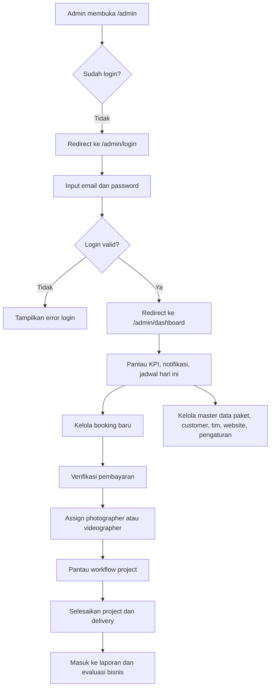

## 1. Gambaran Produk
Admin Panel Fotografi Booking System adalah dashboard operasional untuk studio fotografi yang memusatkan pengelolaan paket, booking, pembayaran, project, customer, tim, konten website, dan laporan dalam satu antarmuka modern.
- Produk ini menyelesaikan masalah operasional yang tersebar di chat, spreadsheet, dan proses manual, sehingga admin studio dapat bekerja lebih cepat, konsisten, dan terukur.
- Nilai bisnis utama adalah meningkatkan efisiensi operasional, menurunkan kesalahan administrasi, mempercepat verifikasi pembayaran, dan mempermudah skalabilitas studio saat volume booking bertambah.

## 2. Fitur Inti

### 2.1 Peran Pengguna
| Peran | Metode Akses | Hak Akses Inti |
|------|--------------|----------------|
| Super Admin | Login email dan password | Akses penuh seluruh modul, pengaturan sistem, role, permission, backup, dan activity log |
| Admin | Login email dan password | Kelola dashboard, booking, pembayaran, paket, portfolio, project, customer, laporan, dan konten website |
| Operator | Login email dan password | Kelola operasional harian seperti booking, pembayaran, kalender, project, dan customer sesuai permission |

### 2.2 Modul Fitur
1. **Autentikasi Admin**: halaman login, proteksi route `/admin`, redirect otomatis, sesi JWT, dan user menu.
2. **Dashboard**: ringkasan KPI, jadwal hari ini, aktivitas terbaru, reminder pelunasan, dan notifikasi realtime.
3. **Booking**: daftar booking, detail booking, kalender booking, pencarian, filter, pagination, perubahan status, cetak invoice, dan assignment tim.
4. **Pembayaran**: daftar pembayaran, preview bukti transfer, verifikasi, penolakan, invoice, dan status pelunasan.
5. **Paket Fotografi**: kategori paket, daftar paket, add-on, promo, pengelolaan benefit, dan galeri paket.
6. **Portfolio**: album, galeri foto, video highlight, upload multi-file, preview, reorder, dan cover album.
7. **Project**: workflow project dari booked sampai completed, jadwal shooting, editing, preview customer, printing, delivery, dan monitoring progres.
8. **Customer**: daftar customer, histori booking, total transaksi, segmentasi status customer, dan pencarian cepat.
9. **Tim**: photographer, videographer, editor, admin, freelance, status aktif, jadwal kerja, dan assignment ke booking.
10. **Kalender Operasional**: tampilan month, week, day untuk booking, shooting, editing, deadline, dan hari libur.
11. **Testimoni**: moderasi testimoni, approve, reject, rating, dan sinkronisasi ke website publik.
12. **Laporan**: pendapatan, booking, paket terlaris, customer terbanyak, tim teraktif, laporan bulanan, tahunan, dan export.
13. **Website CMS**: hero banner, tentang kami, portfolio, FAQ, testimoni, kontak, dan pengaturan konten publik.
14. **Pengaturan**: profil studio, branding, jam operasional, slot booking, metode pembayaran, WhatsApp, media sosial, SEO, dan backup database.
15. **Administrator**: pengelolaan admin, role, permission, dan activity log.

### 2.3 Detail Halaman
| Nama Halaman | Nama Modul | Deskripsi Fitur |
|--------------|------------|-----------------|
| Login Admin | Form Login | Validasi email dan password, state loading, error feedback, redirect ke dashboard jika sesi valid |
| Layout Admin | Sidebar, Header, Breadcrumb, Notification, User Menu | Sidebar collapse-expand, mobile drawer, breadcrumb dinamis, pencarian global, dark mode, user dropdown |
| Dashboard | KPI Cards | Menampilkan total booking, booking hari ini, booking bulan ini, pendapatan, pending payment, customer baru, project aktif, testimoni baru |
| Dashboard | Aktivitas dan Reminder | Jadwal hari ini, aktivitas terbaru, reminder pelunasan, reminder shooting, dan notifikasi operasional |
| Semua Booking | DataTable Booking | Search, filter status, filter tanggal, sorting, pagination, sticky header, bulk action, action dropdown |
| Detail Booking | Ringkasan dan Timeline | Informasi customer, paket, jadwal, histori pembayaran, status booking, status project, invoice, dan assignment tim |
| Kalender Booking | Kalender Operasional | Menampilkan event booking, shooting, editing, deadline, hari libur, dan status warna |
| Semua Pembayaran | DataTable Pembayaran | Preview bukti transfer, approve, reject, filter status, download invoice, kirim invoice |
| Kategori Paket | DataTable Kategori | CRUD kategori fotografi seperti Wedding, Wisuda, Prewedding, Family, Birthday, Corporate, Product, Studio |
| Paket Fotografi | Form Paket | Pengelolaan nama paket, harga, benefit, durasi, jumlah tim, fitur tambahan, popular badge, dan galeri |
| Add-on dan Promo | Form Promo | Pengelolaan item tambahan, harga, periode promo, status aktif, dan relasi ke paket |
| Portfolio | Album dan Media | Upload multiple image, drag and drop, preview, reorder, cover album, dan video highlight |
| Project | Pipeline Project | Tahapan booked, persiapan, shooting, editing, preview customer, revisi, printing, delivery, completed |
| Customer | DataTable Customer | Nama, WhatsApp, email, total booking, total transaksi, status customer, dan histori |
| Tim | DataTable Tim | Peran tim, status aktif, jadwal kerja, assignment ke booking, dan filter per role |
| Testimoni | Moderasi | Daftar testimoni menunggu persetujuan, rating, komentar, approve, reject |
| Laporan | Visualisasi dan Export | Grafik pendapatan, tren booking, paket terlaris, customer terbanyak, export PDF dan Excel |
| Website CMS | Konten Publik | Form banner, section tentang kami, FAQ, kontak, testimoni, dan preview perubahan |
| Pengaturan | Konfigurasi Sistem | Profil studio, logo, favicon, SEO, booking slot, metode pembayaran, backup database |
| Administrator | Role dan Audit | Manajemen admin, role, permission matrix, activity log, dan soft delete/restore |

## 3. Alur Inti
Alur utama dimulai saat admin login ke `/admin/login`, lalu masuk ke dashboard untuk memantau kondisi operasional studio. Dari dashboard, admin dapat berpindah ke modul booking untuk memvalidasi pesanan baru, memeriksa status pembayaran, melakukan assignment tim, lalu mengawasi progres project sampai selesai.

Alur pendukung mencakup pengelolaan master data seperti kategori, paket, add-on, promo, tim, customer, serta pembaruan konten website dan pelaporan periodik. Semua modul admin mengikuti pola interaksi yang konsisten: daftar data, filter dan pencarian, tindakan per item, bulk action, konfirmasi, toast notification, soft delete, dan restore.

## 4. Desain Antarmuka Pengguna
### 4.1 Gaya Desain
- Warna utama menggunakan putih, abu-abu netral, hitam pekat, dan aksen gold yang dipakai terbatas pada state penting, badge, chart highlight, dan CTA utama.
- Gaya tombol menggunakan sudut `rounded-xl`, tinggi konsisten, state hover halus, border lembut, dan bayangan tipis untuk nuansa premium.
- Tipografi mengutamakan sans-serif modern yang rapi dan mudah dibaca admin non-teknis, dengan hirarki jelas antara heading, label, body, caption, dan angka KPI.
- Layout memakai dashboard dengan sidebar kiri, top header sticky, area konten lapang, kartu statistik, panel detail, dan data table modular.
- Ikon menggunakan `lucide-react`, state penting dibedakan dengan warna dan badge, sementara notifikasi memakai tampilan ringkas seperti dashboard SaaS modern.

### 4.2 Ringkasan Desain Halaman
| Nama Halaman | Nama Modul | Elemen UI |
|--------------|------------|-----------|
| Login Admin | Hero login dan form | Latar elegan, kartu login glass effect ringan, input jelas, CTA tegas, error message ringkas |
| Layout Admin | Sidebar dan header | Sidebar premium gelap-terang, header sticky blur, breadcrumb sederhana, notification popover, user menu |
| Dashboard | KPI dan chart | Card metrik dengan angka besar, badge tren, panel aktivitas, tabel ringkas, chart netral dengan aksen gold |
| Data Listing | DataTable global | Sticky header, checkbox, filter bar, bulk action, empty state, loading skeleton, error state |
| Form Admin | Input dan upload | Grid form rapi, validasi inline, drag and drop upload, image preview, section card modular |
| Kalender | Tampilan event | Month, week, day view, warna per jenis event, tooltip cepat, panel detail event |
| Detail Entity | Summary panel | Header tindakan, status badge, timeline, card informasi customer, pembayaran, histori aksi |

### 4.3 Responsivitas
Desain mengikuti pendekatan desktop-first dengan adaptasi tablet dan mobile. Sidebar berubah menjadi drawer pada layar kecil, tabel penting menyediakan horizontal scroll dan prioritas kolom, form dipadatkan ke single-column pada mobile, dan aksi sekunder dipindahkan ke dropdown agar tetap ringan serta mudah dipakai.

### 4.4 Catatan Pengalaman Pengguna
- Semua halaman wajib memiliki loading skeleton, empty state, error state, toast notification, confirmation dialog, dan feedback aksi yang jelas.
- Seluruh data utama memakai soft delete dan restore untuk menjaga keamanan operasional.
- Interaksi global seperti search, filter, sorting, pagination, dan export harus konsisten di semua modul agar admin cepat beradaptasi.
- Dashboard, booking, pembayaran, dan project menjadi prioritas pengalaman tercepat karena merupakan jalur operasional utama studio.

## 5. Tahapan Pengembangan
1. **Tahap 1 - Layout Dashboard**: bangun shell admin, sidebar, header, breadcrumb, notification, user menu, responsive behavior.
2. **Tahap 2 - Authentication**: login admin, proteksi route, sesi JWT, logout, dan refresh sesi.
3. **Tahap 3 - Sidebar Navigation**: struktur menu, submenu, active state, mobile drawer, collapse-expand.
4. **Tahap 4 - Dashboard**: KPI cards, chart, aktivitas terbaru, jadwal hari ini, reminder.
5. **Tahap 5 - Booking**: listing, detail, status, assignment tim, invoice, kalender booking.
6. **Tahap 6 - Pembayaran**: verifikasi pembayaran, preview bukti transfer, invoice, status lunas.
7. **Tahap 7 - Paket Fotografi**: kategori, paket, add-on, promo, benefit, galeri paket.
8. **Tahap 8 - Portfolio**: album, galeri, video highlight, upload multi-file, reorder.
9. **Tahap 9 - Project**: pipeline project, status produksi, deadline, preview customer.
10. **Tahap 10 - Customer**: listing customer, histori booking, segmentasi pelanggan.
11. **Tahap 11 - Tim**: role tim, jadwal, assignment, status aktif.
12. **Tahap 12 - Kalender**: sinkronisasi semua event operasional dalam calendar view.
13. **Tahap 13 - Laporan**: laporan periodik, chart, export PDF dan Excel.
14. **Tahap 14 - Website**: CMS section publik dan preview konten.
15. **Tahap 15 - Pengaturan**: konfigurasi studio, pembayaran, jam operasional, branding, backup.
16. **Tahap 16 - Administrator**: role, permission, activity log, audit trail.
